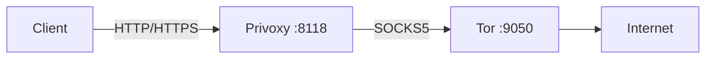

# docker-tor-privoxy-alpine

A Docker image that combines Tor and Privoxy on Alpine Linux, providing a proxy setup with enhanced routing capabilities.

## Project Overview

This project offers a Docker container that integrates Tor and Privoxy on an Alpine Linux base. It's designed to provide a small-footprint proxy solution that can be easily deployed using Docker.



## Components

- **Base Image**: Alpine Linux 3.7
- **Tor**: Onion routing network for secure internet access
- **Privoxy**: Non-caching web proxy with advanced filtering capabilities
- **runit**: Init scheme and service supervision
- **tini**: A minimal init system for containers

## Usage

To run the container with default settings:

```bash
docker run -d -p 8118:8118 -p 9050:9050 rdsubhas/tor-privoxy-alpine
```

To use the proxy:

```bash
curl --proxy localhost:8118 https://www.example.com
```

## Configuration

See `.env.example` for available configuration options.

### Dockerfile

The Dockerfile specifies the following:

- Base image: Alpine 3.7
- Exposed ports: 8118 and 9050
- Installed packages: privoxy, tor, runit, tini
- Copies service configurations from `service/` to `/etc/service/`
- Sets default environment variables for Privoxy and Tor configuration
- Entrypoint: tini
- CMD: runsvdir /etc/service

### Privoxy

- **Config file**: Dynamically generated based on environment variables
- **Listen address**: Configurable via `PRIVOXY_LISTEN_ADDRESS`
- **Forward to Tor**: Configurable via `PRIVOXY_FORWARD_SOCKS5`
- **Run script**: `/etc/service/privoxy/run` (generates config and starts Privoxy in non-daemon mode)

### Tor

- **Config file**: Dynamically generated based on environment variables
- **SOCKS port**: Configurable via `TOR_SOCKS_PORT`
- **Run script**: `/etc/service/tor/run` (generates config and starts Tor)

## Exposed Ports

- 8118: Privoxy HTTP(S) proxy (configurable)
- 9050: Tor SOCKS5 proxy (configurable)

## Building

To build the image yourself:

```bash
docker build -t tor-privoxy-alpine .
```

## License

This project is licensed under the MIT license. Refer to the LICENSE file in the repository for full details.
