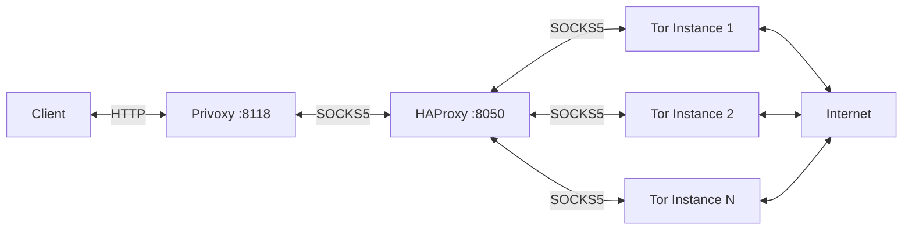

# multi-tor-proxy

This project provides a Docker container that combines multiple Tor instances with HAProxy for load balancing and Privoxy for HTTP proxy functionality. The setup is based on Alpine Linux.

## Architecture

The container orchestrates the following components:

1. Multiple Tor instances
2. HAProxy for load balancing across Tor instances
3. Privoxy as an HTTP proxy frontend



## Components

- **Alpine Linux**: 3.20.3
- **Tor**: 0.4.8.12-r0
- **HAProxy**: 2.8.10-r0
- **Privoxy**: 3.0.34-r2
- **gosu**: 1.17-r5 (from Alpine edge/testing repository)

## Features

- Multiple Tor instances for improved performance and anonymity
- HAProxy load balancing among Tor instances
- Privoxy for HTTP proxy functionality and advanced filtering
- Persistent Tor data storage using Docker volumes
- Configurable via environment variables
- Non-root execution of Tor and Privoxy processes using gosu

## Usage

1. Clone this repository:

   ```sh
   git clone https://github.com/perennialtech/multi-tor-proxy.git
   cd multi-tor-proxy
   ```

2. Create a `.env` file based on the provided `.env.example`:

   ```sh
   cp .env.example .env
   ```

   Adjust the variables in `.env` according to your requirements.

3. Start the container using Docker Compose:

   ```sh
   docker compose up -d
   ```

   This command will build the image if it doesn't exist and start the container in detached mode.

4. Use the Privoxy HTTP proxy:

   ```sh
   curl --proxy http://127.0.0.1:8118 https://am.i.mullvad.net/json
   ```

5. Use the HAProxy SOCKS5 proxy:

   ```sh
   curl --proxy socks5://127.0.0.1:8050 https://am.i.mullvad.net/json
   ```

## Configuration

The container is configured using environment variables. These can be set in the `.env` file or passed directly to the container. Key configuration options include:

- `NUM_TOR_INSTANCES`: Number of Tor instances to run (default: 3)
- `PRIVOXY_LISTEN_ADDRESS`: Address and port for Privoxy (default: "0.0.0.0:8118")
- `TOR_RELAY`: Enable/disable relay mode (default: 0)
- `TOR_NICKNAME`: Nickname for the Tor relay (default: "torPrivoxy")
- `TOR_BANDWIDTH_RATE`: Bandwidth rate limit for the Tor relay (default: "1000000")
- `TOR_BANDWIDTH_BURST`: Bandwidth burst limit for the Tor relay (default: "2000000")
- `TOR_EXIT_POLICY`: Exit policy for the Tor relay (default: "reject *:*")

Refer to the `.env.example` file for a complete list of configuration options.

## Docker Compose

The project includes a `compose.yaml` file for easy deployment using Docker Compose. Key features of the Compose configuration:

- Container name and hostname: `multi-tor-proxy`
- Builds the image from the local Dockerfile
- Maps ports `8118` (Privoxy) and `8050` (HAProxy) to the host
- Uses the `.env` file for environment variables
- Configures automatic restart (`unless-stopped`)
- Creates and uses a named volume `multi-tor-proxy_tor-data` for persistent Tor data

To stop the container:

```sh
docker compose down
```

To stop the container and remove the volume:

```sh
docker compose down -v
```

## Exposed Ports

- `8118`: Privoxy HTTP proxy
- `8050`: HAProxy SOCKS5 proxy (load balances to multiple Tor instances)

## Data Persistence

Tor data for all instances is stored in a Docker volume named `multi-tor-proxy_tor-data`, persisting Tor's state across container restarts.

## Building

To build the image locally without using Docker Compose:

```sh
docker build -t docker-tor-privoxy-alpine .
```

## License

This project is licensed under the MIT License. See the [LICENSE](LICENSE) file for details.
