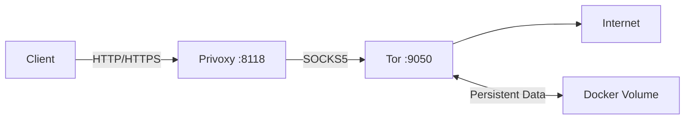

# docker-tor-privoxy-alpine

A Docker image that combines Tor and Privoxy on Alpine Linux, providing a proxy setup with enhanced routing capabilities and Tor data persistence.

## Project Overview

This project offers a Docker container that integrates Tor and Privoxy on an Alpine Linux base. It's designed to provide a small-footprint proxy solution that can be easily deployed using Docker, with the added benefit of Tor data persistence across container restarts.



## Components

- **Base Image**: Alpine Linux 3.20.3
- **Tor**: Onion routing network for secure internet access
- **Privoxy**: Non-caching web proxy with advanced filtering capabilities
- **gosu**: Lightweight tool to step down from root and run processes as non-privileged users
- **Persistent Volume**: For storing Tor data across container restarts

## Usage

To run the container with default settings and Tor data persistence:

```bash
docker compose up -d
```

This command will create a Docker volume named `tor-data` to store Tor's data persistently.

To use the proxy:

```bash
curl --proxy 127.0.0.1:8118 https://example.com
```

## Configuration

The container is configured using environment variables. These can be set in the `.env` file or passed directly to the container. See `.env.example` for available configuration options.

### Dockerfile

The Dockerfile specifies the following:

- Base image: Alpine 3.20.3
- Exposed ports: 8118 and 9050
- Installed packages: privoxy, tor, gosu
- Copies entrypoint.sh script
- Sets default environment variables for Privoxy and Tor configuration
- ENTRYPOINT: /entrypoint.sh

### entrypoint.sh

The entrypoint script handles the following:

- Generates Tor and Privoxy configuration files based on environment variables
- Sets correct permissions for Tor and Privoxy directories
- Starts both Tor and Privoxy services using gosu for privilege de-escalation

gosu is used to run Tor and Privoxy as their respective non-root users:

```sh
exec gosu tor tor -f /etc/tor/torrc & \
exec gosu privoxy privoxy --no-daemon /etc/privoxy/config
```

This ensures that the services run with the least privileges necessary, enhancing security.

### Privoxy

- **Config file**: Dynamically generated based on environment variables
- **Listen address**: Configurable via `PRIVOXY_LISTEN_ADDRESS`
- **Forward to Tor**: Configurable via `PRIVOXY_FORWARD_SOCKS5`

### Tor

- **Config file**: Dynamically generated based on environment variables
- **SOCKS port**: Configurable via `TOR_SOCKS_PORT`
- **Data Directory**: Persistent storage in `/var/lib/tor`, mapped to a Docker volume

## Exposed Ports

- 8118: Privoxy HTTP(S) proxy (configurable)
- 9050: Tor SOCKS5 proxy (configurable)

## Tor Data Persistence

Tor data is stored in a Docker volume named `tor-data`. This ensures that Tor's state, including its entry guards and other critical information, is preserved across container restarts.

To manage the persistent Tor data:

- **View volume information**: `docker volume inspect docker-tor-privoxy-alpine_tor-data`
- **Backup the data**: `docker run --rm -v tor-data:/data -v /path/on/host:/backup alpine tar cvf /backup/tor-data.tar /data`
- **Restore from backup**: `docker run --rm -v tor-data:/data -v /path/on/host:/backup alpine sh -c "cd /data && tar xvf /backup/tor-data.tar --strip 1"`

## Building

To build the image yourself:

```bash
docker build -t tor-privoxy-alpine .
```

## Security Considerations

This project uses gosu to enhance security by running Tor and Privoxy as non-root users. This follows the principle of least privilege, reducing the potential impact of any security vulnerabilities in these services.

## License

This project is licensed under the MIT license. Refer to the LICENSE file in the repository for full details.
