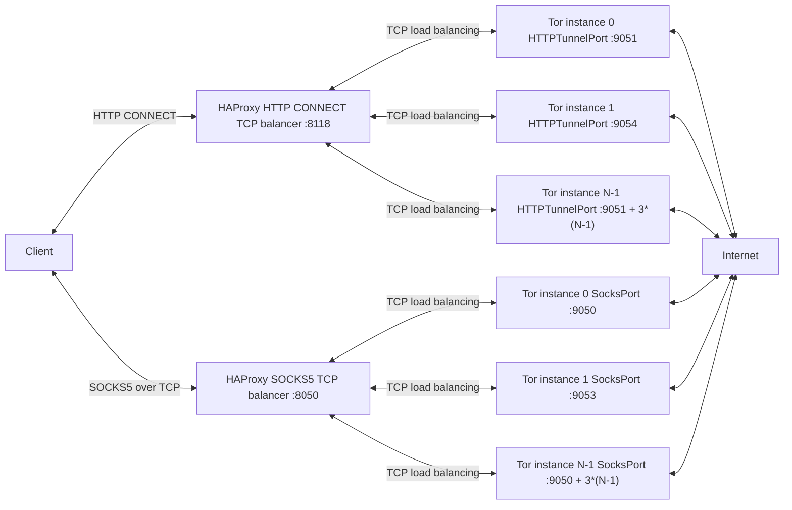

# multi-tor-proxy

multi-tor-proxy is a Dockerized Tor proxy stack that provides:

- an [HTTP CONNECT](https://developer.mozilla.org/en-US/docs/Web/HTTP/Reference/Methods/CONNECT) proxy through [HAProxy](https://www.haproxy.org/) and [Tor `HTTPTunnelPort`](https://2019.www.torproject.org/docs/tor-manual.html.en#HTTPTunnelPort)
- a [SOCKS5](https://en.wikipedia.org/wiki/SOCKS) proxy through HAProxy and Tor `SocksPort`
- multiple Tor client instances behind the proxy layer


```mermaid
graph LR
    Client[Client]
    HAProxyHTTP[HAProxy HTTP CONNECT TCP balancer :8118]
    HAProxySOCKS[HAProxy SOCKS5 TCP balancer :8050]
    Tor0HTTP[Tor instance 0 HTTPTunnelPort :9051]
    Tor1HTTP[Tor instance 1 HTTPTunnelPort :9054]
    TorLastHTTP["Tor instance N-1 HTTPTunnelPort :9051 + 3*(N-1)"]
    Tor0SOCKS[Tor instance 0 SocksPort :9050]
    Tor1SOCKS[Tor instance 1 SocksPort :9053]
    TorLastSOCKS["Tor instance N-1 SocksPort :9050 + 3*(N-1)"]
    Internet[Internet]

    Client <-->|HTTP CONNECT| HAProxyHTTP
    Client <-->|SOCKS5 over TCP| HAProxySOCKS
    HAProxyHTTP <-->|TCP load balancing| Tor0HTTP
    HAProxyHTTP <-->|TCP load balancing| Tor1HTTP
    HAProxyHTTP <-->|TCP load balancing| TorLastHTTP
    HAProxySOCKS <-->|TCP load balancing| Tor0SOCKS
    HAProxySOCKS <-->|TCP load balancing| Tor1SOCKS
    HAProxySOCKS <-->|TCP load balancing| TorLastSOCKS
    Tor0HTTP <--> Internet
    Tor1HTTP <--> Internet
    TorLastHTTP <--> Internet
    Tor0SOCKS <--> Internet
    Tor1SOCKS <--> Internet
    TorLastSOCKS <--> Internet
```

The `8118` listener is backed by Tor `HTTPTunnelPort`. It supports HTTP `CONNECT` tunneling, which is suitable for HTTPS proxy requests.

Internal Tor listener ports are allocated in three-port blocks per instance. Instance `i` uses `SocksPort` `9050 + 3*i` and `HTTPTunnelPort` `9051 + 3*i`. The third slot in each block is intentionally unused, and the container does not run or expose a Tor `DNSPort`.

It is not a full plaintext HTTP forwarding proxy. For non-HTTPS URLs, use the SOCKS5 listener instead when your client supports it.

When using the SOCKS5 proxy directly, make sure your client sends hostnames through the proxy instead of resolving them locally.

With curl, use `socks5h://` or `--socks5-hostname`.

## Load balancing and rotation semantics

HAProxy balances each new TCP connection across the Tor backends with round-robin. It does not rebalance individual HTTP requests inside a reused TCP connection.

Tor still controls circuit construction and stream attachment. `NewCircuitPeriod`, `MaxCircuitDirtiness`, and `CircuitBuildTimeout` influence Tor's circuit behavior, but they do not guarantee a fresh circuit or a fresh exit IP for every request.

Client connection pooling matters. Browsers, HTTP libraries, package managers, and scraping tools often reuse proxy connections, so many application-level requests may travel through the same HAProxy backend and the same Tor circuit until the client opens a new connection or Tor decides to attach new streams elsewhere.

Established proxy tunnels have a fixed one-hour idle timeout at the HAProxy layer.

## Quick start

Configuration environment variables are optional. Runtime defaults are defined in `entrypoint.sh`, so unset or blank values use those code defaults.

Run with code defaults:

```sh
docker compose up -d
```

Create `.env` only when you want overrides. `.env.example` lists supported variables and validation notes, but intentionally does not duplicate the actual defaults.

```sh
cp .env.example .env
$EDITOR .env
docker compose up -d --force-recreate
```

### Docker Compose

```sh
git clone https://github.com/perennialtech/multi-tor-proxy.git
cd multi-tor-proxy
docker compose up -d
```

### `docker run`

```sh
docker volume create tor-data

docker run -d \
  --name multi-tor-proxy \
  --hostname multi-tor-proxy \
  --init \
  --restart unless-stopped \
  --publish 127.0.0.1:8118:8118/tcp \
  --publish 127.0.0.1:8050:8050/tcp \
  --volume tor-data:/var/lib/tor \
  ghcr.io/perennialtech/multi-tor-proxy:latest
```

For overrides, create `.env` from `.env.example` and add `--env-file .env` to the command.

## Test the proxy

HTTP CONNECT proxy for HTTPS requests:

```sh
curl --proxy http://127.0.0.1:8118 https://check.torproject.org/api/ip
```

SOCKS5 proxy with remote DNS:

```sh
curl --proxy socks5h://127.0.0.1:8050 https://check.torproject.org/api/ip
```

The response should indicate that the request came through Tor.

## License

This project is licensed under the MIT License. See [LICENSE](LICENSE).
